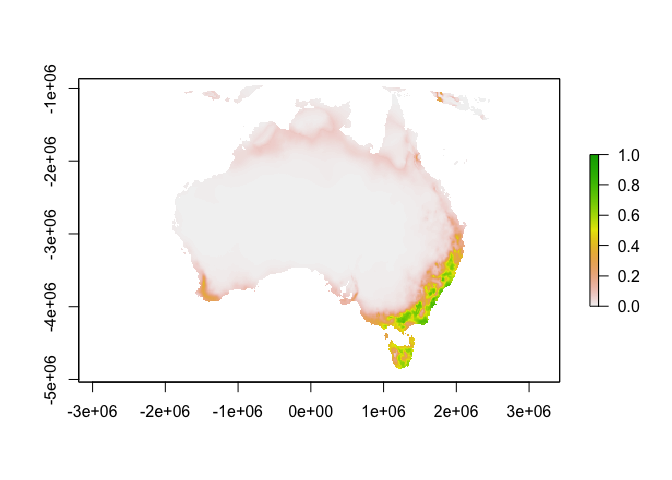

Simplifying Maxent model-fitting in R
================

*This package is a work in progress*

## Installation

``` r
remotes::install_github('johnbaums/sdm')
remotes::install_github('johnbaums/rmaxent')
```

## Example

The below example is purely for demonstration. I have not assessed the
quality of occurrence data or of the resulting model.

``` r
library(rmaxent)
library(sdm)
library(raster)
```

    ## Loading required package: sp

``` r
library(sf)
```

    ## Linking to GEOS 3.7.2, GDAL 2.4.2, PROJ 5.2.0

``` r
# If Maxent is < 3.4.0, download Maxent 3.4.1 and copy to the dismo/java folder
if(maxent_version() < '3.4.0') rmaxent::get_maxent('3.4.1')
```

### Get and clean occurrence data

``` r
occ <- get_ala_occ('Cercartetus nanus', target_crs=3577)
```

    ## Getting ALA data for Cercartetus nanus (guid = urn:lsid:biodiversity.org.au:afd.taxon:1cb198f0-1ec4-450c-9af3-6fa4066099cb)

    ## 3223 records.

``` r
occ_clean <- clean_occ(occ)
```

### Load predictors

``` r
# Load some enviro rasters
bio <- raster::getData('worldclim', var='bio', res=10)
e <- raster::extent(112, 154, -44, -9)
bio_moll <- raster::projectRaster(
  raster::crop(
    raster::stack(list.files('wc10', '\\.bil$', full=TRUE)), 
    e, snap='out'),
  crs=raster::crs(occ_clean),
  res=15000
)
```

### Generate background data

10,000 random points within 500km of occurrences

``` r
bg <- sample_background(n=10000, occ=occ_clean, template_raster=bio_moll, 
                        buffer_width=300000)
```

    ## Warning in sample_background(n = 10000, occ = occ_clean, template_raster =
    ## bio_moll, : Requested 10000 cells but only 4998 available.

``` r
plot(bio_moll$bio1)
points(sf::as_Spatial(bg), pch='.')
points(sf::as_Spatial(occ_clean), pch=20, cex=0.5, col='red')
```

<!-- -->

### Fit model

``` r
m <- fit_maxent(occurrence=occ_clean, background=bg, 
                predictors=bio_moll[[c(1, 5, 6, 12)]], 
                outdir=tempdir(), features='lpq', beta=2, 
                replicates=5, curves=TRUE, 
                full_args=c(writebackgroundpredictions=TRUE),
                outputformat='raw',
                return_model=TRUE)
```

    ## 425 occurrence records (unique cells).

### Project model

``` r
pred <- rmaxent::project(m$model_full, bio_moll)
```

    ## 
    Calculating contribution of feature  1 of 10
    Calculating contribution of feature  2 of 10
    Calculating contribution of feature  3 of 10
    Calculating contribution of feature  4 of 10
    Calculating contribution of feature  5 of 10
    Calculating contribution of feature  6 of 10
    Calculating contribution of feature  7 of 10
    Calculating contribution of feature  8 of 10
    Calculating contribution of feature  9 of 10
    Calculating contribution of feature 10 of 10

``` r
plot(pred$prediction_logistic)
```

<!-- -->

``` r
plot(pred$prediction_cloglog)
```

<!-- -->
